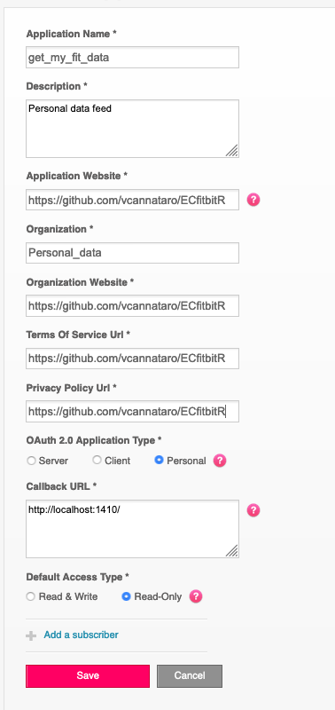

```{r setup, include=FALSE}
knitr::opts_chunk$set(echo = TRUE)
```

# ECfitbitR

You can use the `ECfitbitR` package to access your FitBit data through the FitBit API and format your data for easy analysis. This package relies heavily on the excellent [`fitbitr`](https://github.com/teramonagi/fitbitr) package to do the heavy lifting of interacting with the API. Please visit [`fitbitr`](https://github.com/teramonagi/fitbitr) for more details of the extensive functionality therein, as `ECfitbitR` is designed with limited but specific functionality in mind. 

## First things first

### Creating a FitBit web app 

The first thing you need to do to access your own FitBit data is make a personal FitBit API web app. 

1. Go to [https://dev.fitbit.com/apps/new](https://dev.fitbit.com/apps/new) and log into your FitBit account. 
2. Register your application. This is your own personal app for your own personal data, so you do not need a terms of service to share with clients. Hence, we just use the website of the R package (https://github.com/vcannataro/ECfitbitR) for our terms. 



3. Retrieve your Client ID (FITBIT_KEY) and your Client Secret (FITBIT_SECRET). You can find these here: [https://dev.fitbit.com/apps](https://dev.fitbit.com/apps). 


You are now ready to access your data! Well, first you need a toolkit to use. We will use the free, open source, statistical computing platform [`R`](https://www.r-project.org/). 

### Downloading R

1. Go to [https://cloud.r-project.org/](https://cloud.r-project.org/) and select your specific download for your specific operating system. 
2. Follow the instructions to download and install `R`. 

## Installation

`ECfitbitR` is a mostly self-contained package, but it does have some dependencies that need to be installed. 

1. Open R 
2. Click File --> New Document (or whatever the equivalent is in your operating system). 
3. Copy and paste the following into the document. 

```{r, eval=F}
# installing dependencies 
install.packages(c("stringr","lubridate","dplyr","tidyr","purrr","rlang","httr","jsonlite","httpuv","RCurl","devtools"))
```

4. On the line of the code that you just copied, press `CMD+return` (or `ctrl+enter` on PC, etc.) 
  + If prompted for a mirror (where the download will come from), click the top cloud or whatever is closest to your location
  + If prompted with a message about "Do you want to install from sources the package which needs compilation? (Yes/no/cancel)" type `Yes` and hit enter. 
  
5. On a new line in your document, copy the following and then repeat step 4. 

```{r, eval=F}
devtools::install_github("teramonagi/fitbitr"); devtools::install_github("vcannataro/ECfitbitR")
```


