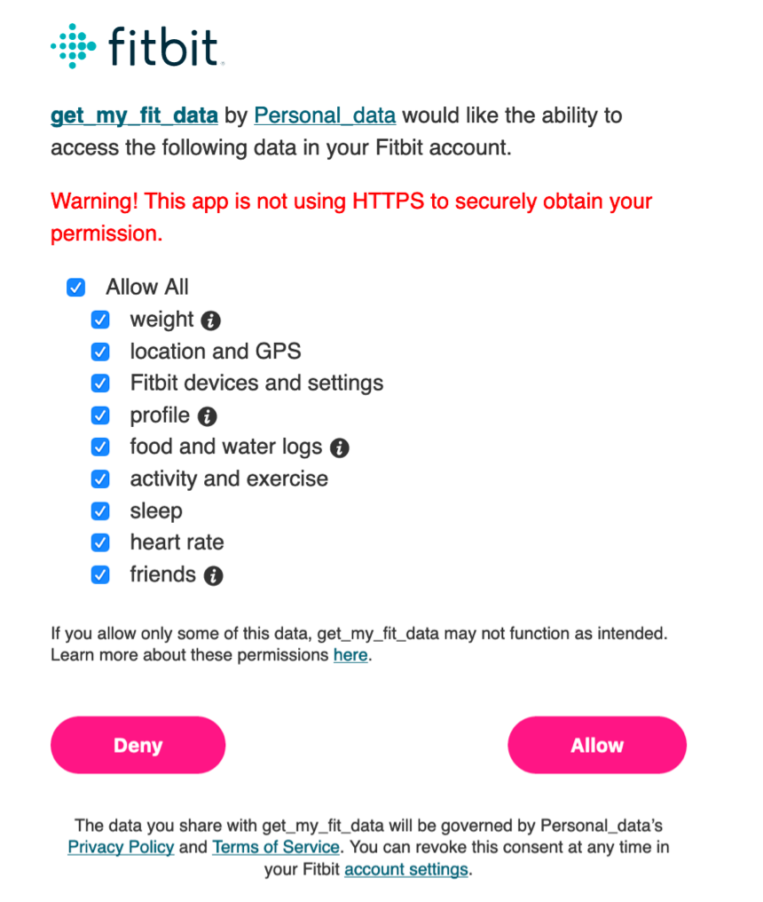

Vincent L. Cannataro

# ECfitbitR

You can use the `ECfitbitR` package to access your FitBit data through
the FitBit API and format your data for easy analysis. This package
relies heavily on the excellent
[`fitbitr`](https://github.com/teramonagi/fitbitr) package to do the
heavy lifting of interacting with the API. Please visit
[`fitbitr`](https://github.com/teramonagi/fitbitr) for more details of
the extensive functionality therein, as `ECfitbitR` is designed with
limited but specific functionality in mind.

## First things first

### Creating a FitBit web app

The first thing you need to do to access your own FitBit data is make a
personal FitBit API web app.

1.  Go to <https://dev.fitbit.com/apps/new> and log into your FitBit
    account.
2.  Register your application. This is your own personal app for your
    own personal data, so you do not need a terms of service to share
    with clients. Hence, we just use the website of the R package
    (<https://github.com/vcannataro/ECfitbitR>) for our terms.
    **IMPORTANT:** the fields must exactly match what is in this image.
    Feel free to copy+paste my inputs:

<!-- end list -->

  - `https://github.com/vcannataro/ECfitbitR`
  - `http://localhost:1410/` (for Callback URL)

Also make sure to set your `OAuth 2.0 Application Type` as `Personal`.


3.  Retrieve your Client ID (FITBIT\_KEY) and your Client Secret
    (FITBIT\_SECRET). You can find these here:
    <https://dev.fitbit.com/apps>.


You are now ready to access your data\! Well, first you need a toolkit
to use. We will use the free, open source, statistical computing
platform [`R`](https://www.r-project.org/).

### Downloading R

1.  Go to <https://cloud.r-project.org/> and select your specific
    download for your specific operating system.
2.  Follow the instructions to download and install `R`.

## Installation

`ECfitbitR` is a mostly self-contained package, but it does have some
dependencies that need to be installed.

1.  Open R
2.  Click File –\> New Document (or whatever the equivalent is in your
    operating system).
3.  Copy and paste the following into the document. You may be prompted
    to select a “mirror” server to download the packages from—choose
    either the top one or whatever location is closest to you (this
    mattered more when download speed was highly dependent on distance
    to
servers).

<!-- end list -->

``` r
install.packages(c("stringr","lubridate","dplyr","tidyr","purrr","rlang","httr","jsonlite","httpuv","RCurl","devtools"))
```

4.  On the line of the code that you just copied, press `CMD+return` (or
    `ctrl+enter` on PC, etc.)

<!-- end list -->

  - If prompted for a mirror (where the download will come from), click
    the top cloud or whatever is closest to your location
  - If prompted with a message about “Do you want to install from
    sources the package which needs compilation? (Yes/no/cancel)” type
    `Yes` and hit enter.

<!-- end list -->

5.  On a new line in your document, copy the following and then repeat
    step 4. **NOTE:** If on PC, you may be asked to update a certain
    Rtools package, or to update existing packages. Just hit `Enter` to
    skip the update at the
prompt.

<!-- end list -->

``` r
devtools::install_github("teramonagi/fitbitr"); devtools::install_github("vcannataro/ECfitbitR")
```

You are now ready to download your data\!

Every time a chunk of code is presented below in a gray box, you can
either copy it directly into the R terminal and press `return` or
`Enter`, or you can develop your own `R script` using a New Document
(step 2 above) and press `CMD+return` or `ctrl+enter` to send it to the
terminal. If you copy multiple lines into the `R script` you can send
the code to run in the terminal line-by-line, or you can highlight a
chunk of code and then hit `CMD+return`. The advantage of having the`R
script` is that you can save the script and return to it later—allowing
you to see the exact steps you took to get to your end product (very
important in the reproducibility of science and analyses)\!

Every time you see the `#` sign in the code it is a “comment” and R
automatically does not run comments.

As a general note, you need to run the following code chunks in order
because much of the subsequent code depends on the code prior to it.

## Downloading your FitBit data

### Initializing the API

The first thing we will do is tell FitBit who you are. For this, we need
the `FITBIT_KEY` and `FITBIT_SECRET` generated in the First things first
step.

``` r
# load the key and secret into your R environment. 
FITBIT_KEY <- "your fitbit key pasted here in the quotes"
FITBIT_SECRET <- "your fitbit secret pasted here in the quotes"
```

Next, we will authorize ourselves to obtain our own data. After running
the next block of code your internet browser will prompt you to
authorize your app. Highlight relevant fields and click `Allow`. It will
look like this:

``` r
token <- fitbitr::oauth_token()
```



### Downloading your data from fitbit

Run the following code to download your data from fitbit:

``` r
my_data <- ECfitbitR::get_my_data(token=token)
```

Test to see if it worked. We will look at the top-level data so it may
not be very exciting (top starts midnight to 12:05am)… but if anything
is there, it worked\!

``` r
# heartrate summary 
head(my_data$my_heartrate_data$heartrate_daily_summary)

#heartrate by minute for yesterday (we can go down to second resolution if we want in the future)
head(my_data$my_heartrate_data$heartrate_intraday_data[[length(my_data$my_heartrate_data$heartrate_intraday_data)]])

# calorie data from yesterday 
head(my_data$my_activity_data$calories_list[[length(my_data$my_activity_data$calories_list)]])

# steps data from yesterday
head(my_data$my_activity_data$steps_list[[length(my_data$my_activity_data$steps_list)]])

# distance data from yesterday
head(my_data$my_activity_data$distance_list[[length(my_data$my_activity_data$distance_list)]])

# summary of sleep data
head(my_data$my_sleep_data$sleep_data_output)
```

You can save all of your data to your computer in an R data file
(.RData). Just change the directory in the quotes in the following code
block and run the block. Make sure to keep the `my_fitbit_data.RData`,
or pick your own name, so that your file has a name. I am saving
directly to my Desktop:

``` r
save(my_data, file = "~/Desktop/my_fitbit_data.RData") 
```

You can also save your data as a .csv to open in other programs, like
Microsoft Excel.

``` r
# saving heartrate data summary
write.csv(x = my_data$my_heartrate_data$heartrate_daily_summary,file = "~/Desktop/my_heartrate_data.csv", row.names = F)
```
